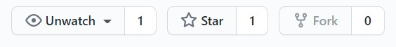

# Github Action 签到工具集

## 今日签到状态

%E7%96%AB%E6%83%85%E7%AD%BE%E5%88%B0/badge.svg?branch=master)

## 开发计划
- 部署各类常用的签到
    - v2ex
    - bangumi
    - 天翼云
    - qq邮箱扩容
- 签到结果提示
    - 接入qq/或者server酱之类的bot工具
- 部署自动爬虫
- 尝试结合其他自动化工具
## 使用说明
#### 1. Fork 本仓库
点击右上角的fork按钮

#### 2.设置secrets变量
再点击右上角的头像

选择repositories找到你fork到的仓库

再点击你的仓库右上角的 Settings，找到 Secrets 这一项，添加一个环境变量。

#### 贴吧签到
- 需要在Secrets中设置签到参数
    - 参数：tieba
    - 该值为需要签到的贴吧账号的BDUSS值
    - BDUSS获取请自行百度
- 设置完变量后，点击star即可触发action

#### b站签到
- 需要在Secrets中设置签到参数
    - 参数：bilibili
    - 该值为需要签到的b站账号的COOKIE
    - 获取方法：打开[bilibili-Info](https://api.live.bilibili.com/sign/GetSignInfo) 再按f12进入开发者模式, 选择network，再使用f5刷新
     - 点击 GetSignInfo 即可找到 cookie
    
- 设置完变量后，点击star即可触发action

#### 宁波工程学院签到（测试中）
- 需要在Secrets中设置签到参数
    - 参数：nbut
    - 该值为需要签到的学生账号的 bearer token
    - 获取该值需要抓包，这里暂时省略   
- 设置完变量后，点击star即可触发action
    
## 签到触发
- 使用点击star进行手动触发
- 根据设置在不同时间自动触发
    - 贴吧：1,2,3 点 05 分
    - b站：6,12 点 00 分
    - 学院疫情签到：6,7,8 点 00 分
